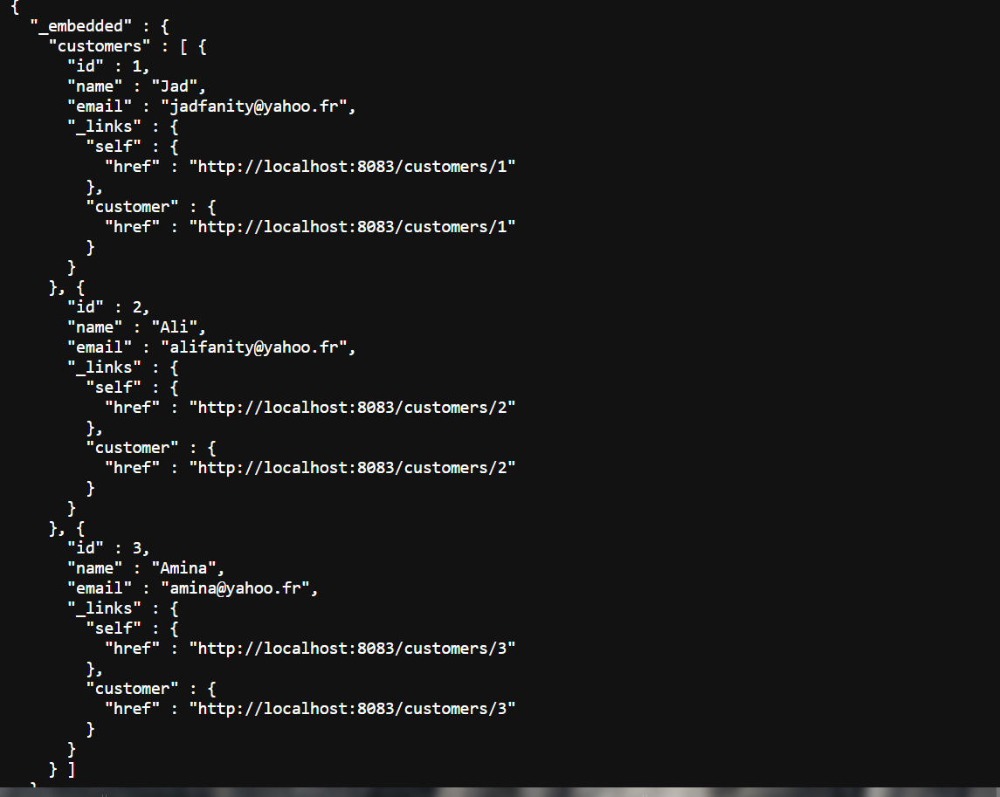
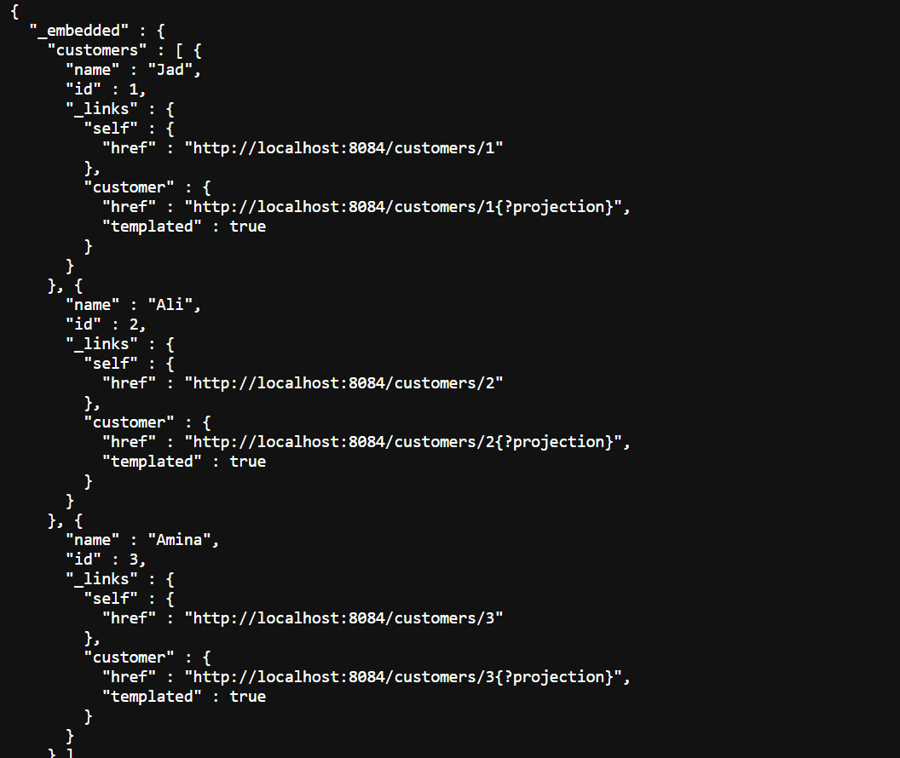
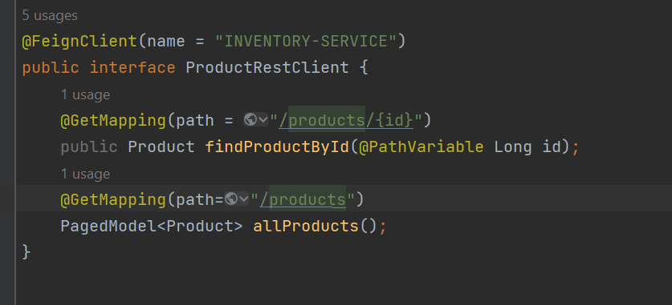
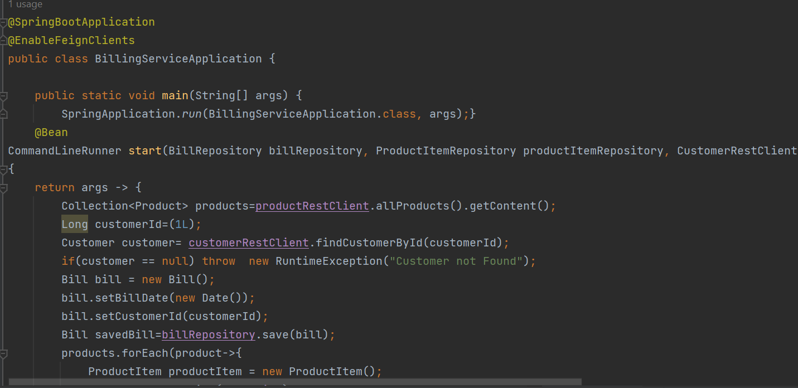
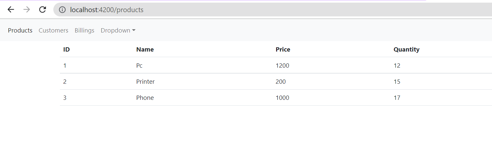

<h2>1.Créer le micro-service customer-service qui permet de gérer les client</h2> 

<h2>2.Créer le micro-service inventory-service qui permet de gérer les produits</h2>

<h2>3. Créer la Gateway Spring cloud Gateway</h2>

Ici on retrouve le port de la Gateway 9999

<h2>4. Configuration statique du système de routage</h2>

Routage Statique

<h2>5. Créer l'annuaire Eureka Discrovery Service</h2>

Pour cela on crée un DiscoveryService on lui donnant le port 8761

On remarque sur le screen ci-dessous qu'il y'a les differents micro-services en marche.

<h2>6. Faire une configuration dynamique des routes de la gateway</h2>

Configuration systeme pour les routes dynamiques

Pour cet exemple on rentre par le nom du micro Service en question (CUSTOMER-SERVICE)

<h2>7. Créer le service de facturation Billing-Service en utilisant Open Feign</h2>

On utilise le Feign au  niveau de Produit et de Customer 

<h2>8. Créer un client Web Angular (Clients, Produits, Factures)</h2>
    <h3>Angular Clients<h3>
    
    <h3>Angular Produits<h3>
    
    <h3>Angular Factures<h3>
    